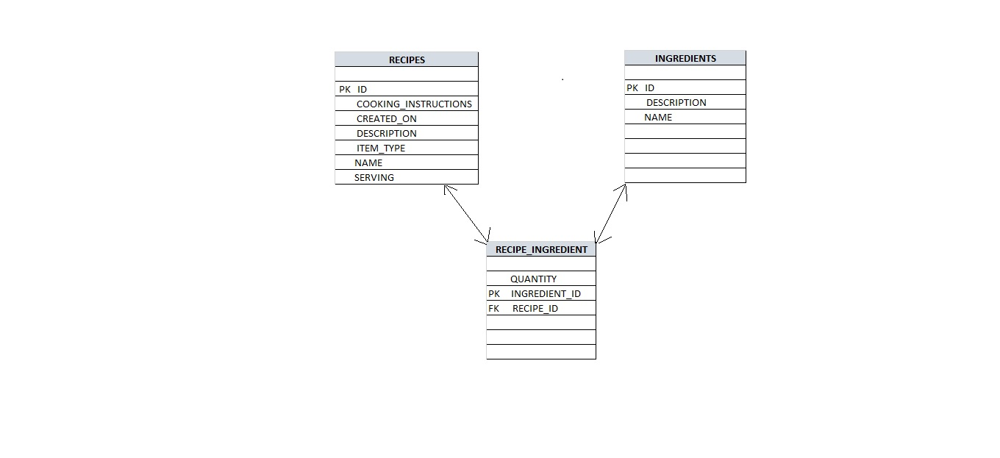

# Getting Started with Spring Boot application
Let me introduce the technology i used while creating the application are java 11,Maven,H2 DataBase.  


# Creating Spring Boot Recipe Management application
This application provides REST APIs to manage different recipes and ingredients. An ingredient can be added independently, then include in the favourite recipes.


## Database design
This Application use the in-memory DB in Spring Boot that’s why I choose H2 as a dependency when creating my project. You can always change thing in your pom.xml file and use maven clean build  later (and if you’re using your jar to run the application maven install too).
This application has three database tables. One table is to store Recipes, another table is to store Ingredients and there is an intermediate table to manage mapping between recipes and ingredients.



## REST APIs
This application exposes seperate REST APIs to deal Recipes and Ingredients.

### Recipes
The following REST APIs are created to manage recipes.

| Method | Url                  | Description                  | Sample Request |
|--------|----------------------|------------------------------| ------------------- |
| POST   | /recipes             | Create a new recipe          | [JSON](#createrecipe) |
| PUT    | /recipes/{recipe_id} | Update an existing recipe    |[JSON](#updaterecipe) |
| GET    | /recipes/{recipe_id} | Get recipe details of the given recipe id ||
| POST   | /recipes/search      | Search recipies              | [JSON](#searchrecipe)|


### Ingredients

| Method | Url                          | Description | Sample Valid Request Body |
| ------ |------------------------------| ----------- | ------------------------- |
| POST    | /ingredients                 | Create anew ingredient | [JSON](#createingredient) |
| PUT    | /ingredients/{ingredient_id} | Update an existing ingredient | [JSON](#updateingredient) |
| GET    | /ingredients                 | Get all ingredients | |
| GET    | /ingredients/{ingredient_id} | Get the details of the ingredient id| |
| DELETE    | /ingredients/{ingredient_id} | Delete an ingredient| |

## Sample requests


##### <a id="createrecipe">Create recipe</a>
```json
{
   "name":"pizza",
   "description":"Pizza six inches",
   "itemType":"NON_VEG",
   "serves": 6,
   "cookingInstructions":"Add the Topping and Mix The ingredient ,bake the pizza,etc...",
   "ingredients":[
      {
         "id":29102,
         "name":"Cheese",
         "quantity":10
      }
   ]
}
```
##### <a id="updaterecipe">Update recipe</a>
```json
{
   "id": 1111,
   "name":"pizza",
   "description":"Pizza six inches",
   "itemType":"NON_VEG",
    "serves": 6,
   "cookingInstructions":"Add the Topping and Mix The ingredient, bake the pizza,etc...",
   "ingredients":[
      {
         "id":29102,
         "name":"Cheese",
         "quantity":10
      }
   ]
}

```
##### <a id="searchrecipe">Search recipes</a>
```json
[
  {
    "key": "name",
    "operation": ":",
    "value":"Pizza"
  },
  {
    "key": "cookingInstructions",
    "operation": ":",
    "value":"Pizza Instructions"
  },
  {
    "key": "serving",
    "operation": "<",
    "value":"3"
  },
  {
    "key": "itemType",
    "operation": "=",
    "value":"VEG"
  },
  {
    "key": "includeIngredients",
    "operation": "=",
    "value":"Tomatoes,Salt"
  },
  {
    "key": "excludeIngredients",
    "operation": "=",
    "value":"Pepper"
  }
]

```
##### <a id="createingredient">Create Ingredient</a>
```json
{
"name": "cheese",
"description": "cheese"
}
```

##### <a id="updateingredient">Update Ingredient</a>
```json
{
"id": 1,
"name": "cheese",
"description": "cheese"
}
```

## Technologies used

* Java 11
* SpringBoot
* Maven
* H2 database

## Architecture used
* Model-View-Controller (MVC)


## Steps to Setup

**1. Clone the application**

```bash
git clone https://github.com/perfacto/Springboot_Recipe_management.git
```

**2. Run the following command.**

```bash
mvn spring-boot:run
```

The app will start running at <http://localhost:8080>

